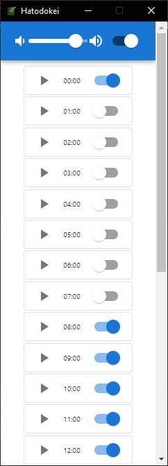

# 鳩時計時報

シンプルな時報アプリ
- ダウンロード: https://github.com/iwase22334/hatodokei/releases




## 機能

 - [x] 時報
 - [x] 特定の時報をミュート
 - [x] 全体の音量調整
 - [x] タスクトレイ在中
 - [ ] 設定の保存
 - [ ] 時間の追加・編集
 - [ ] 音声ファイルの読み込み

## 動作確認環境

 - Windows 10

## 開発

開発言語は、Rust(バックエンド) + React/ts(フロントエンド)。
GUIおよび音声再生に以下のライブラリを使用。

Third party libraries

 - Tauri: https://github.com/tauri-apps/tauri
 - rodio: https://github.com/RustAudio/rodio

### Build

- debug
```
cargo tauri dev
```

- release
```
cargo tauri build
```

## Lisence

ソースコード:
MIT

音声データ:
フリー素材キャラクター「つくよみちゃん」（© Rei Yumesaki）を使用しています。
https://tyc.rei-yumesaki.net/
■音声合成ソフト：つくよみちゃん@COEIROINK
